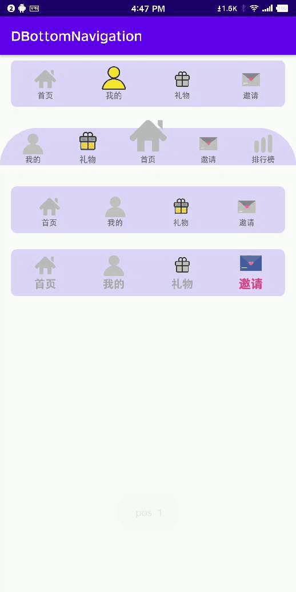

# DBottomNavigation

#### 可高度自定义的底部导航栏
#### 高度自定义可能不是很美观，但是高度自定义
#### 自定义内容
1.自定义选中动画
2.自定义文字颜色选择器
3.自定义item的占比比例
4.自定义item的背景选择器
5.item可溢出父布局显示
6.自定义item的缩放大小
7.自定义各个边距



相关Api

| api                                                          | 描述                                                         |
| ------------------------------------------------------------ | ------------------------------------------------------------ |
| `setItems(List<DNavigationItem> items)`                      | 设置导航栏的item，要先设置设置在进行其它设置                 |
| `setNavItemStartEndMargin(int navItemStartEndMargin)`        | 导航栏内左右边距，不是导航栏本身，<br>是承载item的容器在导航栏中的左右边距 |
| `setNavItemBottomMargin(int navItemBottomMargin)`            | 导航栏内底部边距，不是导航栏本身，<br>是承载item的容器在导航栏中的底部边距 |
| `setNavItemTopMargin(int margin)`                            | 导航栏内顶部边距，不是导航栏本身，<br/>是承载item的容器在导航栏中的顶部边距 |
| `setItemTopMargin(int margin)`                               | 设置每一个item的顶部边距                                     |
| `setIconNameMargin(int margin)`                              | 设置icon图片和name文字之间的间距                             |
| `setOnItemClickListener(DNavigationItemClickListener listener)` | 设置点击事件监听                                             |
| `setSelectedItem(int pos) `                                  | 主动设置选择哪个item                                         |
| `setCustomItemAnim(DCustomNavigationItemAnim itemAnim)`      | 自定义选中动画                                               |
| `setBackgroundViewConfig(final BackgroundConfig config)`     | 设置背景，以及背景的相关配置<br>你可以直接给导航栏设置背景，不调用此方法。 |
| `setTextColor(int textColor)`                                | 设置字体颜色，选中和未选中都一个颜色                         |
| `setNameSelectorColor(@ColorRes int selectorColor)`          | 设置文字选择器，选中和未选中，<br>的color selector文件id     |
| `setTextTTF(String fontName, int style)`                     | 自定义文字样式                                               |
| `setNameTextSize(int sp)`                                    | 设置文字大小                                                 |

```java
   /**
     * 普通的使用
     */
    private void initNav() {
        List<DNavigationItem> mDNavigationItems = new ArrayList<>();
        mDNavigationItems.add(new DNavigationItem(this, new DNavItemConfig(R.drawable.selector_tab_home, "首页"), true));
        mDNavigationItems.add(new DNavigationItem(this, new DNavItemConfig(R.drawable.selector_tab_my, "我的")));
        mDNavigationItems.add(new DNavigationItem(this, new DNavItemConfig(R.drawable.selector_tab_redeem, "礼物")));
        mDNavigationItems.add(new DNavigationItem(this, new DNavItemConfig(R.drawable.selector_tab_invite, "邀请")));
        DBottomNavigation navigation = findViewById(R.id.mainNav);
        navigation.setItems(mDNavigationItems)
                .setBackgroundViewConfig(new BackgroundConfig(R.drawable.shape_nav_bg2));
        navigation.setOnItemClickListener(this);
    }
```

